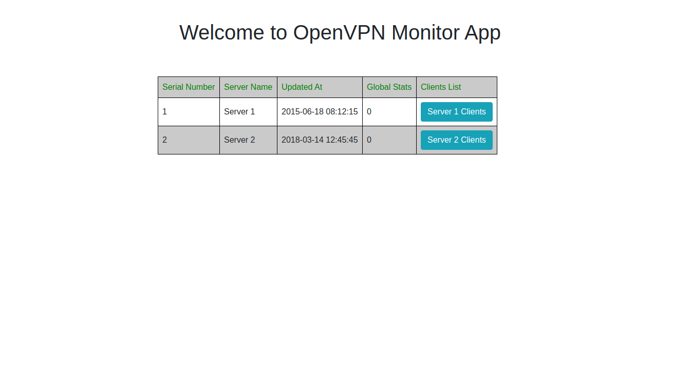
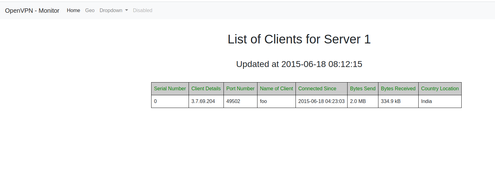

# OpenVpn-Monitor-Flask

Pre Requirement Installation

OpenVpn-Status - https://pypi.org/project/openvpn-status  
IP2Location - https://www.ip2location.com/developers/python  
Flask - https://pypi.org/project/Flask  

Don't forget to provide path of your log file in the given python file.

